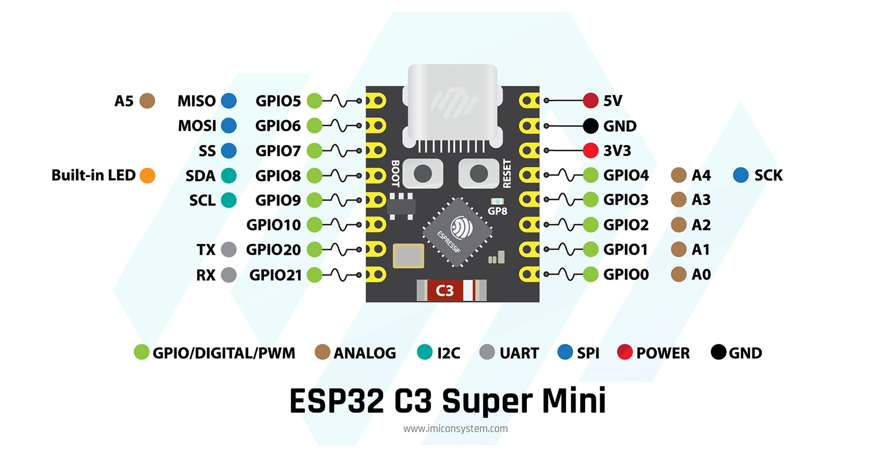
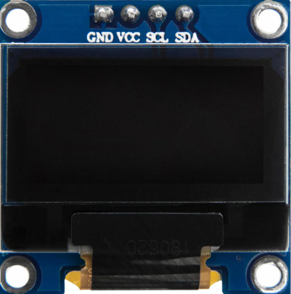
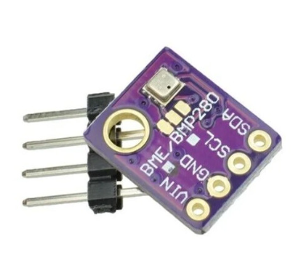
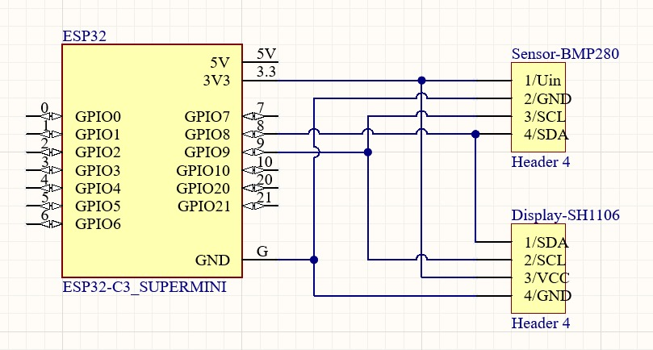

# ESP_Raumluftsensor
## Pinout des ESP32 C3

Wichtige Pins:
+ SDA: GPIO 8
+ SCL: GPIO 9
+ Stromversorgung: GND und 3V3

## Display (0,96 Zoll SSD1306)

+ Ansteuerung über **I²C**
+ Versorgung mit **3.3V-5V**
+ Auflösung: **128*64**
+ Leistungsaufnahme: **0,04W** im Normalbetrieb
+ Abmessungen: **27mm x 27mm x 4,1mm**

## Sensor (BME280)

+ Ansteuerung über **I²C**
+ Versorgung mit **3.3V-5V**
+ Temperatur: **-40°C bis 85°C** ± 1°C
+ Luftdruck: **300hPa bis 1100hPa** ± 1hPa
+ Luftfeuchtigkeit: **0%-100%** ± 3%

## Schaltung

## PCB

## Gehäuse

## Aufbau

## Code (Platform IO)